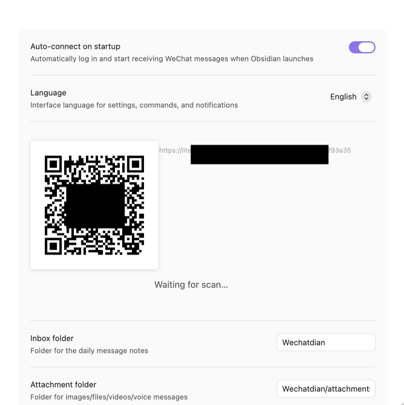
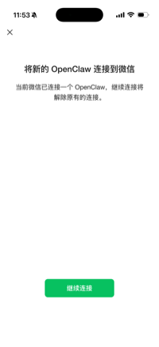
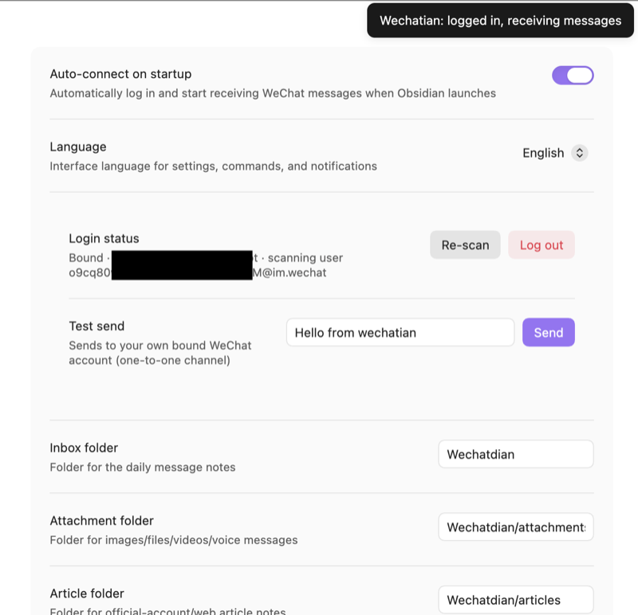
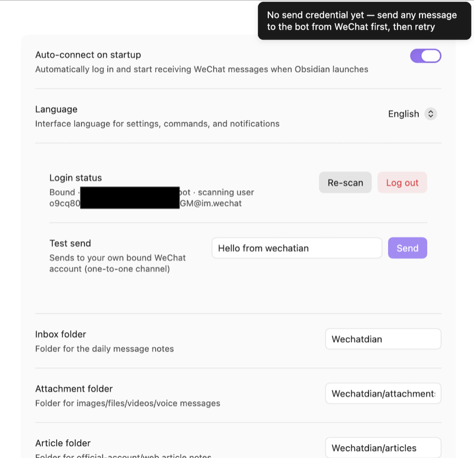
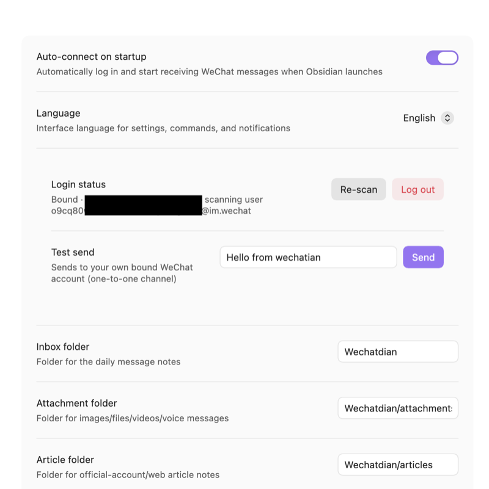
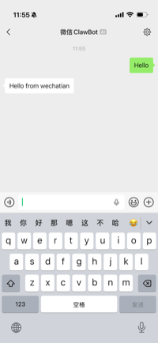
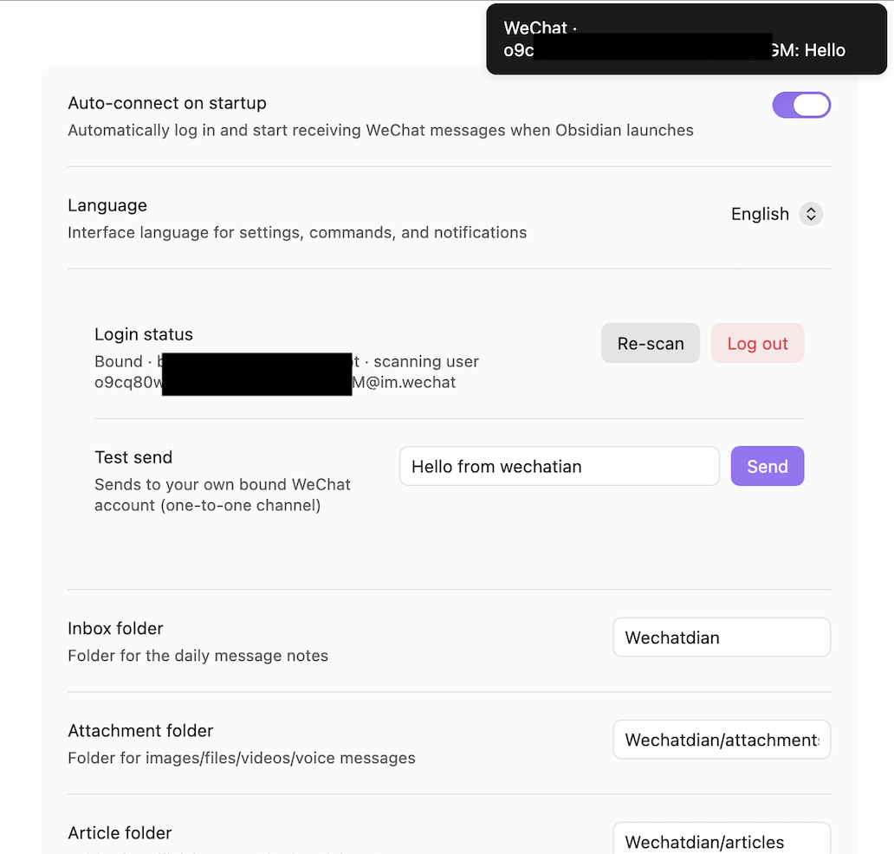
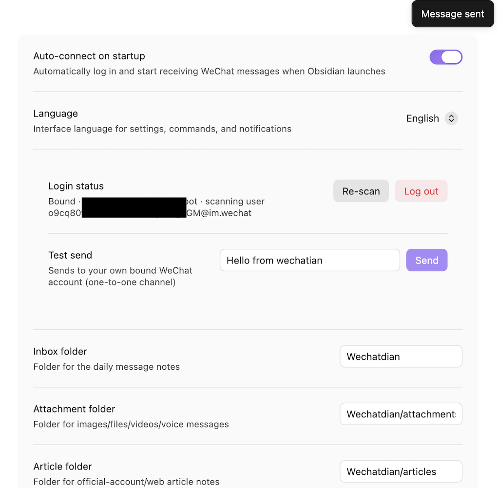

# Wechatian

**Your WeChat, inside your vault.**

Wechatian is an [Obsidian](https://obsidian.md) plugin that bridges WeChat and your vault through Tencent's official **ilink** bot gateway — no unofficial protocol hacks, no self-hosted relay. Messages you receive become searchable notes; your AI assistant can WeChat you by dropping a file into a folder.

## Why

Your most important conversations happen on WeChat — but they're trapped in the app: unsearchable, unlinkable, lost when you switch phones. Wechatian pulls them into your knowledge base:

- **Inbox on autopilot** — messages, photos, documents, and article links received on WeChat are written into your vault as Markdown, automatically. Searchable, linkable, permanently yours.
- **AI that reaches you** — a long task finished? A decision needed? Your agent writes one file and you get a WeChat notification. Reply one line, it reads it back from the vault.
- **Official channel** — runs on the WeChat-approved ilink bot gateway; no modified clients, no self-hosted relay.
- **Local by design** — messages are written only to your vault. Nothing is uploaded, stored, or analyzed anywhere else.

## Features

- **Inbox** — incoming WeChat messages become daily conversation notes (`<inbox>/YYYY-MM-DD.md`, received + sent in one timeline); media decrypted into `attachments/`; links fetched in full as markdown article notes
- **Outbox** — a file-based send channel: drop an `.md` (sent as text, **markdown supported**) or an image / video / document ≤100MB (sent as an attachment) into `outbox/`
- **Agent-ready** — the plugin maintains an `Agent.md` in the inbox folder teaching any AI assistant the outbox protocol; see [Agent.md](Agent.md) in this repo for the full guide
- **QR login** — scan once; the plugin binds to the scanning account and only accepts messages from it
- **Configurable paths** — inbox / attachments / articles / outbox folders are all settable
- **Bilingual UI** — English / 中文 / follow Obsidian

## Install

**Community store (recommended):** Obsidian → Settings → Community plugins, search **Wechatian**, install and enable.

**From a release:** copy `main.js`, `manifest.json`, `styles.css` from the [latest release](https://github.com/laruence/wechatian/releases/latest) into `<vault>/.obsidian/plugins/wechatian/` and enable (assets are CI-built and signed: `gh attestation verify main.js --owner laruence`).

**From source:**

```bash
git clone https://github.com/laruence/wechatian.git && cd wechatian
npm install
OBSIDIAN_PLUGIN_DIR=/path/to/vault/.obsidian/plugins/wechatian npm run build
```

**Via AI agent:** hand it this repo and say *"Read the README and install Wechatian into my vault."*

## Quick start

Five steps, about five minutes:

1. Open Obsidian → Settings → Wechatian. A QR code appears in the login section.

   

2. Scan it with WeChat and confirm — a bot contact appears in your contacts, and the plugin reports the login:

   <p align="center"></p>

   

3. **Send any message to the bot from WeChat once.** The gateway only issues the send credential after the bound account has messaged the bot — until then, sending fails with exactly this notice:

   

4. The settings page now shows the bound account and a live test-send box. Hit **Send** — the phone that messaged the bot in step 3 receives the reply, closing the loop:

   

   <p align="center"></p>

5. Send yourself a message from WeChat — a toast confirms it landed, and within a second it's in `<inbox>/YYYY-MM-DD.md`.

   

## Usage

```
Wechatian/              # inbox folder (all paths configurable)
├── Agent.md            # instructions for AI agents (plugin-maintained)
├── 2026-08-17.md       # daily conversation note (received + sent)
├── attachments/        # media
├── articles/           # full-text article notes
└── outbox/             # write a file here to send it
```

All paths are configurable in settings.

### Sending

Write **one file** into `outbox/`. No API, no recipient — it's a one-to-one channel to your own bound WeChat:

| Write into `outbox/` | Result |
|---|---|
| `notify.md` | content sent as a text message (**markdown supported** — headings, lists, bold, code blocks) |
| `chart.png`, `report.pdf` … | sent as an attachment (image / video / document, ≤100MB) |

A "Message sent" toast confirms delivery; the message is also recorded in the daily note.



The plugin picks files up on its next poll (~30–60 s). Judge the result by the file:

- **File gone** = sent — recorded in today's conversation note (media gets a copy in `attachments/` and is linked)
- **File still there** = failed — an `.md` gets a trailing `<!-- Wechatian send failed: ... -->` comment; media gets a `<name>.wechatian-failed.md` sidecar explaining why

### For AI agents

This is the half that makes Wechatian more than a backup tool: agents read the plugin-maintained `<inbox>/Agent.md`, learn the outbox protocol, and start notifying you — task done, question to settle, nothing more. See [Agent.md](Agent.md) for the full protocol (sending, result judging, reading replies, rate limits). Never call any API; the file channel is the whole interface.

## FAQ

**Does it need to stay running?**
Yes — the bridge works while Obsidian is open with the plugin enabled. It's lightweight; enable auto-connect in settings if you want it online whenever Obsidian starts.

**What if my computer is offline?**
No problem. Messages sent to the bot while you're offline are held by the gateway, and Wechatian picks them up automatically the next time you open Obsidian. One caveat: how long the gateway keeps messages isn't documented — treat very old offline messages as best-effort.

**Why can't it send messages right after I scan the QR?**
The gateway issues the send credential only after the bound account has sent the bot at least one message. Send any message to the bot from WeChat once (step 3 above) and sending unlocks.

**Does it receive images, videos, and files?**
Yes — media arrives decrypted in `attachments/` and is embedded in the daily note. Links to articles are additionally fetched in full as markdown notes in `articles/`.

**Why didn't a forwarded article/file arrive?**
Known gateway limitation: the bot can't receive *forwarded* articles or files. Send the original link or the file itself instead.

**Does it work on Obsidian mobile?**
The plugin runs on desktop only. But the notes it writes are plain Markdown — sync your vault (iCloud / Git / Obsidian Sync) and read the full history on your phone.

## Good to know

- **Rate limit** — the gateway throttles proactive sends; this is a notification/decision channel, not a chat tool
- **Offline catch-up** — messages sent while the computer is offline are picked up automatically next time Obsidian starts (gateway retention period is undocumented)
- **One device per account** — concurrent long polling from multiple devices competes for the message stream; run the plugin on one machine
- **No forwarding** — see FAQ above
- **Privacy & security** — messages live only in your vault; only the QR-scanning account is accepted

## Ideas

- **AI notification channel** — the headline use case: your agent pings you on WeChat when long work finishes, you steer it back with one reply
- **Personal CRM** — conversations with key contacts land in your vault automatically; add tags, link them to project notes
- **Journal byproduct** — daily notes double as a searchable timeline of your day's conversations
- **Any tool can send** — the outbox is just a folder: scripts, shortcuts, cron jobs — anything that can write a file can WeChat you

---

## 中文说明

> 微信 ↔ Obsidian 双向桥接插件：收消息自动入 vault，agent 往发件箱丢个文件就能给你发微信。走腾讯官方 ilink 机器人网关，数据只落本地。

**Wechatian** 把微信变成 vault 的双向通道：

- **收**：消息实时写入每日对话笔记（收发同一时间线）；媒体解密存 `attachments/`；链接全文抓取成 markdown 文章笔记
- **发**：往 `outbox/` 丢文件——`.md` 作为文本消息发送（**支持 markdown**），图片/视频/文档（≤100MB）作为附件发送
- **Agent**：插件在收件箱目录维护 `Agent.md`，AI 助手读完即学会发件协议——长任务跑完、需要拍板时主动给你发微信；完整指南见 [Agent.md](Agent.md)
- **扫码登录**：扫一次即绑定该账号，只接收该账号的消息；路径全部可配置；界面中英双语

**快速上手**（约五分钟）：

1. Obsidian → 设置 → Wechatian，登录区出现二维码
2. 微信扫码确认，通讯录里出现一个 bot 联系人
3. **先在微信里给 bot 发任意一条消息**——网关只在绑定账号发过消息后才下发发送凭证，这一步解锁发送方向
4. 状态栏显示"微信已连接"，双向通道就绪

**注意事项**：网关对主动消息限流（通知/拍板渠道，不是聊天工具）；同一账号只在一台设备运行插件（多设备长轮询会抢消息流）；bot 收不到*转发*的文章和文件，请发原始链接或文件本身。电脑离线也没关系——离线期间发给 bot 的消息会在下次打开 Obsidian 时自动抓取（网关保留多久暂不明确）。

安装方式与英文版相同：社区市场搜索 **Wechatian**；或从 release 复制三个文件到 `.obsidian/plugins/wechatian/`；或 `npm run build` 从源码构建。

## License

[MIT](LICENSE)
